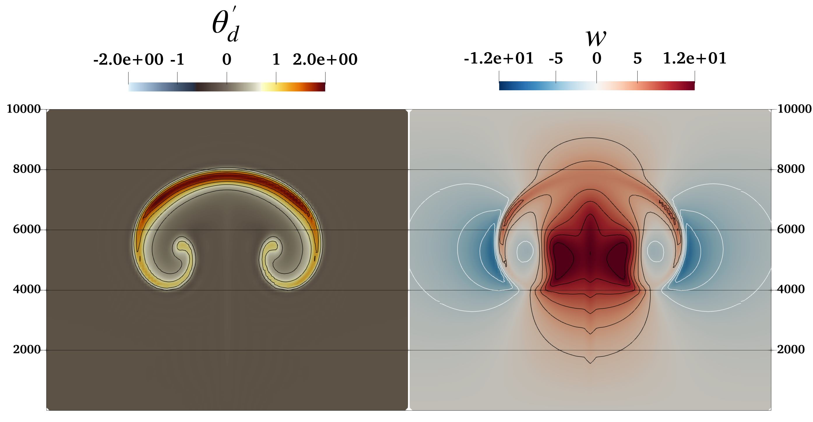
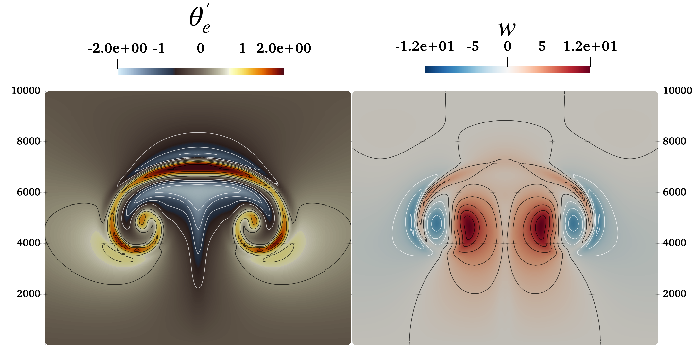

# Bubble Rise (moist and dry)

Results presented herein were generated with ERF hash: **9428c70** and inputs files: `inputs_BF02_dry_bubble ` and `inputs_BF02_moist_bubble`.
    
Both the dry and moist case are two-dimensional with domain lengths $(L_x, L_z) = (20 \times 10^3, 10\times10^3)$ [m] and grid resolution of $(\Delta x, \Delta z) = (100, 100)$ [m]. Simulations were run for $1000$ [s] with an RK3 time-step of $\Delta t=0.5$ [s] and 4 acoustic sub-steps in the last RK stage. All boundary conditions are free-slip walls. The $3^{\rm rd}$ order upwind scheme was employed for the advection operator and the fluid was completely inviscid. Finally, we note that the non-precipitating version of the Kessler microphysics model was employed for the moist bubble case 
    

Perturbational potential temperature, $\theta_{d}^{\prime}$ = $\theta_{d}$ - 300 [K], (top to bottom) at $t$ = 300, 600, 900 [s] for (left) compressible and (right) anelastic modes with multiple levels. Contour lines are spaced every 1 [K] and the green outline denotes the regions of refinement.

Perturbational potential temperature, $\theta_{d}^{\prime}$ = $\theta_{d}$ - 300 [K], (top to bottom) at $t$ = 300, 600, 900 [s] for (left) compressible and (right) anelastic modes with multiple levels. Contour lines are spaced every 1 [K] and the green outline denotes the regions of refinement.   

