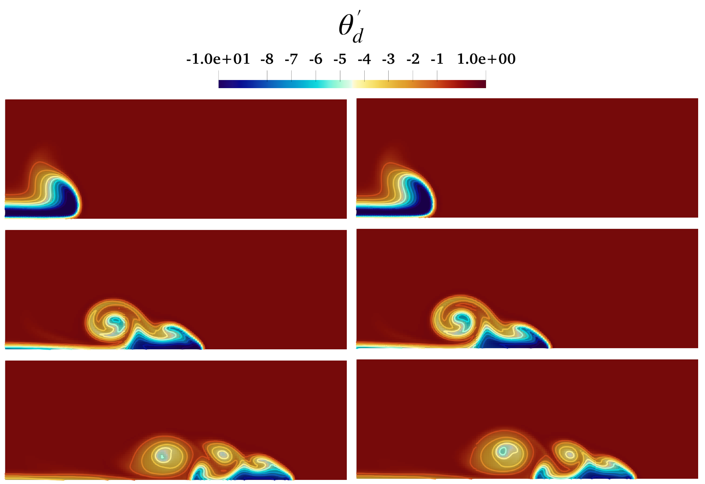
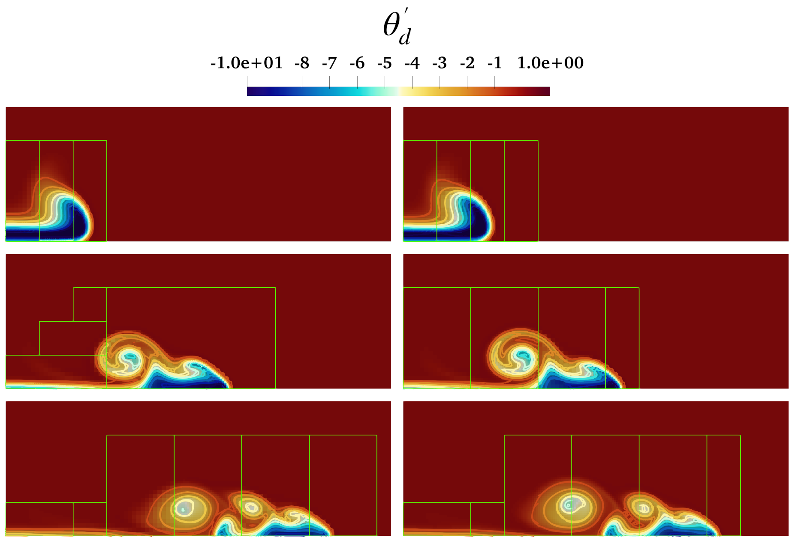

# Density Current

Results presented herein were generated with ERF hash: **9428c70** and inputs files: `inputs_crse_halfdomain` and `inputs_crse_halfdomain_amr`. We note that the anelastic option may be activated in the inputs files by setting *erf.anelastic = 1*.
    
The test case is two-dimensional with domain lengths $(L_x, L_z) = (25.6\times 10^3, 6.4\times 10^3)$ [m] and has a grid resolution of $(\Delta x, \, \Delta z) = (100.0, \, 100.0)$ [m]. The simulation is run for 900 [s] of simulated time with an RK3 time step of 1.0 [s] and 4 acoustic sub-steps in the last RK stage. The left boundary employs a symmetry condition while the right boundary is an outflow condition. The top and bottom boundaries are slip walls. The 3$^{\rm rd}$ order upwind scheme and constant diffusivities of $\nu$ = $\alpha_{\theta}$ = 75 [m$^2$/s] were employed; no turbulence model was used. 
    

Perturbational potential temperature, $\theta_{d}^{\prime}$ = $\theta_{d}$ - 300 [K], (top to bottom) at $t$ = 300, 600, 900 [s] for (left) compressible and (right) anelastic modes with multiple levels. Contour lines are spaced every 1 [K] and the green outline denotes the regions of refinement.

Perturbational potential temperature, $\theta_{d}^{\prime}$ = $\theta_{d}$ - 300 [K], (top to bottom) at $t$ = 300, 600, 900 [s] for (left) compressible and (right) anelastic modes with multiple levels. Contour lines are spaced every 1 [K] and the green outline denotes the regions of refinement.   

