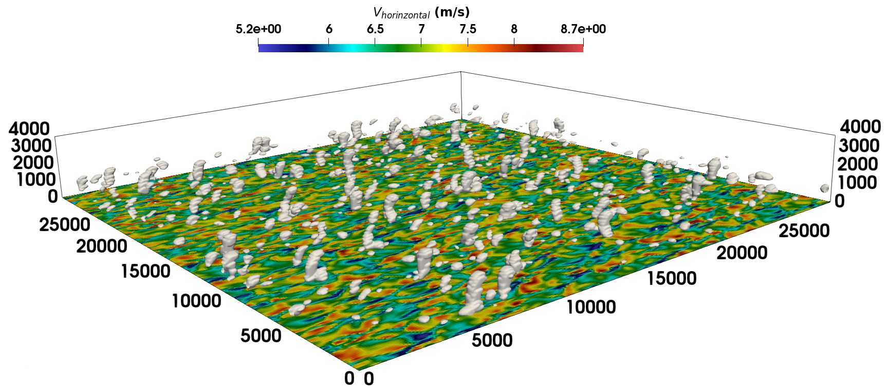
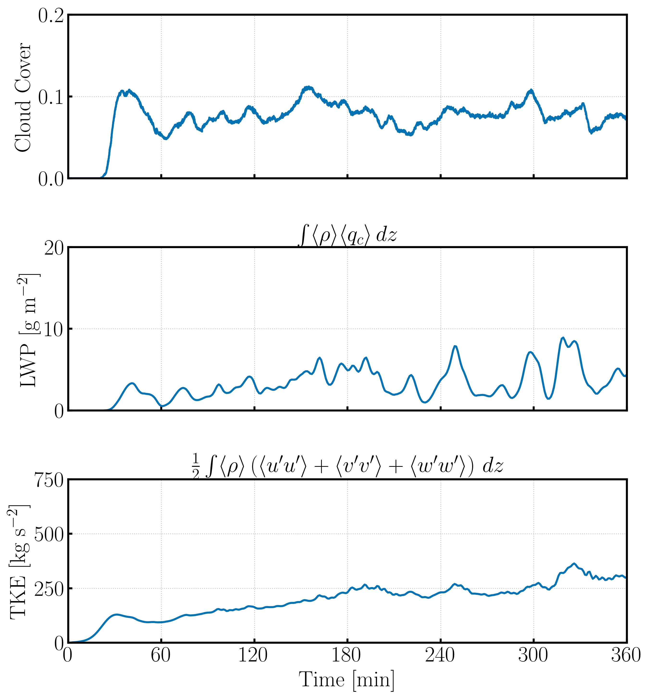
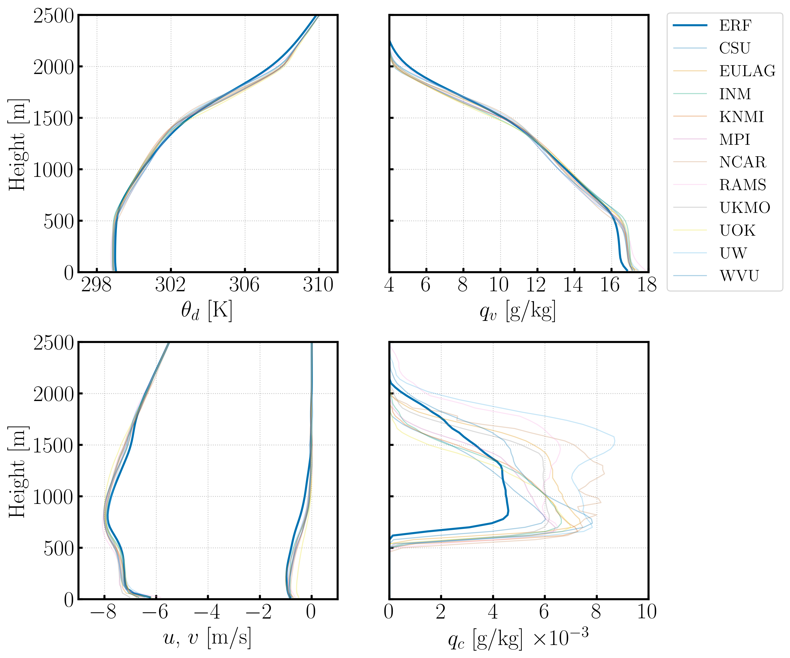
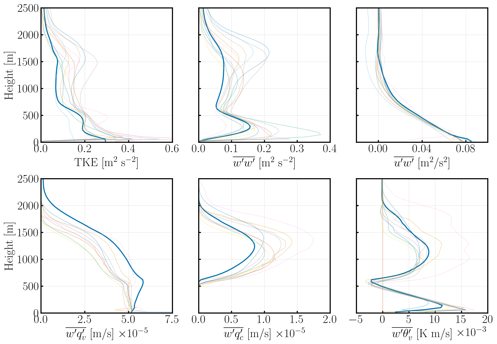

# Shallow Cumulus Convection

Results presented herein were generated with ERF hash: **9428c70** and inputs files: `inputs_Kessler`.

The time series, mean profile, and turbulent flux images were generated by way of the interactive notebook `BOMEX_postproc.ipynb`.
    
The simulation configuration employs a domain size of $(L_x, \, L_y, \, L_z) = (6.4\times 10^3, \, 6.4\times 10^3, \, 4.0\times 10^3)$ [m] with a mesh resolution of $(\Delta x, \, \Delta y, \, \Delta z) = (100, \, 100, \, 40)$ [m]. The simulation time is $6~\text{hrs}$, with an RK3 time step of 0.3 [s] and 4 acoustic sub-steps in the last RK stage. The domain is doubly periodic in the horizontal directions, has a free-slip condition at the top boundary, and specified fluxes at the bottom boundary from MOST. The 3$^\text{rd}$ order upwind scheme with a monotonicity preserving switch is used for the advection operator. The Kessler microphysics scheme without rain and the Smagorinsky model with $C_{s} = 0.17$ were used.
    

Isocontour of cloud water mixing ratio ($q_c$ = $6\times10^{-6}$ [kg/kg]) and the turbulent velocity field for the  BOMEX simulation on a 30 [km] $\times$ 30 [km] $\times$ 3.6 [km] domain with a resolution of $(\Delta x, \Delta y, \Delta z) = (100,100,40)$ [m], at $t=1.6$ hours.

Temporal evolution of the total cloud cover (top), liquid water path (middle), and integrated turbulent kinetic energy (bottom) for the BOMEX case.

State variables spatially-averaged in the $xy$-plane, and time-averaged in the last hour for the BOMEX case: (Row wise) Potential temperature, vapor mixing ratio, horizontal wind velocities, and cloud water mixing ratio.

Turbulence quantities spatially-averaged in the $xy$-plane, and time-averaged in the last 3 hours for the BOMEX case: (Row wise) turbulent kinetic energy, turbulent fluxes -- $\overline{w'w'}$, $\overline{u'w'}$, $\overline{w'q_v'}$, $\overline{w'q_l'}$, and $\overline{w'\theta_v'}$. Line-styles match the legend provided in the mean profiles above.