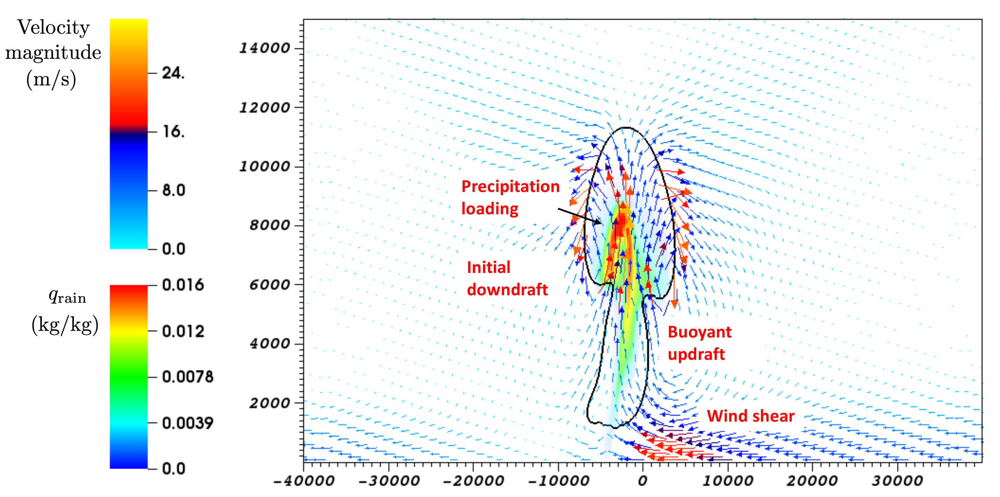
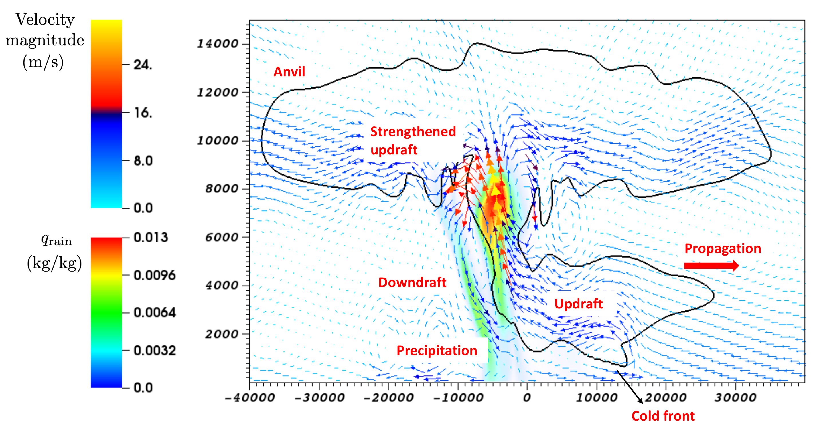
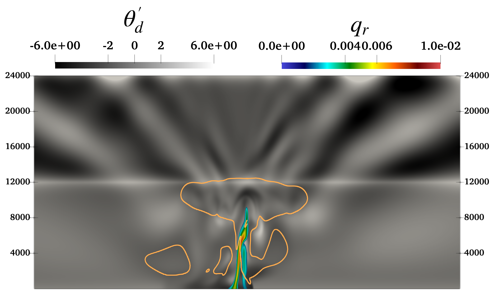
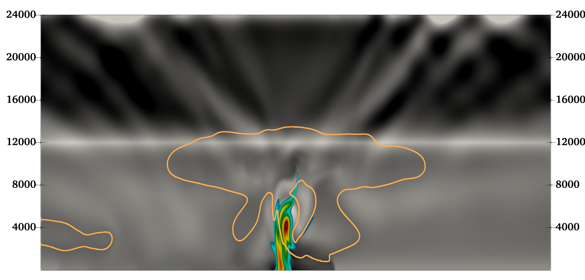
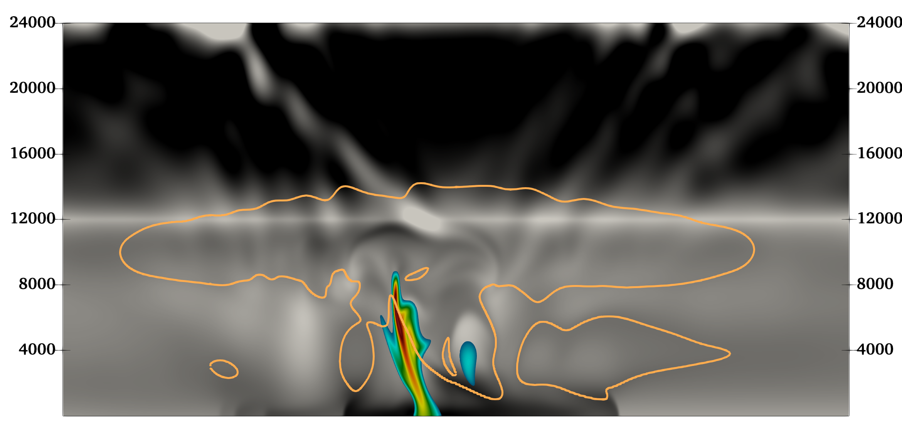
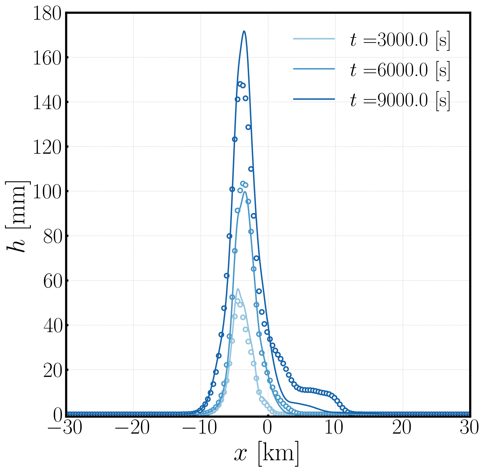

# Squall Line

Details regarding the Squall Line test case may be found in [Gabersek et al. (2011)](https://doi.org/10.1175/MWR-D-11-00144.1).
    
Results presented herein were generated with ERF hash: **9428c70** and [inputs file](https://github.com/erf-model/ERF/blob/9428c70c5c299fd8c11bc0b15634b917e16bdf7b/Exec/MoistRegTests/SquallLine_2D/inputs_moisture_Gabersek) .

Raw data and python script for the rain accumulation figure are provided in the `Rain_Accum` directory.
    
A domain size of $(L_x, L_z) = (150\times 10^3, 24\times 10^3)$ [m], with grid resolution $(\Delta x, \Delta z) = (100, 100)$ [m] was employed. The simulation was run for 2.5 hours, with an RK3 time step of 0.25 [s] and 4 acoustic sub-steps in the last RK stage. Lateral walls utilized an open boundary while the bottom wall employed a free-slip condition and the top wall was a high-order outflow -- i.e., linear extrapolation for scalar quantities and a Neumann condition for velocity. The $3^{\rm rd}$ order upwind scheme was used for advection while the Kessler microphysics were employed for moisture. Constant diffusivities of $\nu = \alpha_{i} = 200$ [ $m^{2}$ /s] were utilized for momentum and all scalars; no turbulence model was employed.

  <figure>
    

      

        
      

      

        
      

    

  </figure>

Development of the two-dimensional squall line - vectors of velocity colored by velocity magnitude, $q_c=10^{-5}$ [kg/kg] isocontour (black line), and contours of rain are shown: (a) at $t$=1500 [s] showing the surface wind shear, buoyant updrafts, precipitation accumulation inside the cloud, and initial downdrafts, and (b) at $t$=7500 [s] showing the propagation of the squall line, the cold front, updrafts and downdrafts, precipitation, and the anvil structure of the cloud.

  <figure>
    

      

        
      

      

        
      

      

        
      

    

  </figure>

The squall line simulation at (top) $3000$ [s], (middle) $6000$ [s], and (bottom) $9000$ [s]. The orange contour denotes the cloud $q_{c} = 10^{-5}$ [kg/kg] and the perturbation potential temperature is given by $\theta_{d}^{\prime} = \theta_{d}(t) - \theta_{d}(0)$ [K]. Note, the horizontal $x$-direction has been clipped to $[-60, 60]$ [km] to highlight the region of interest around the cloud.

  <figure>
    
  </figure>

The rain accumulation, $h(x;t)$, obtained from ERF (solid lines) versus WRF (markers) for the squall line case.
