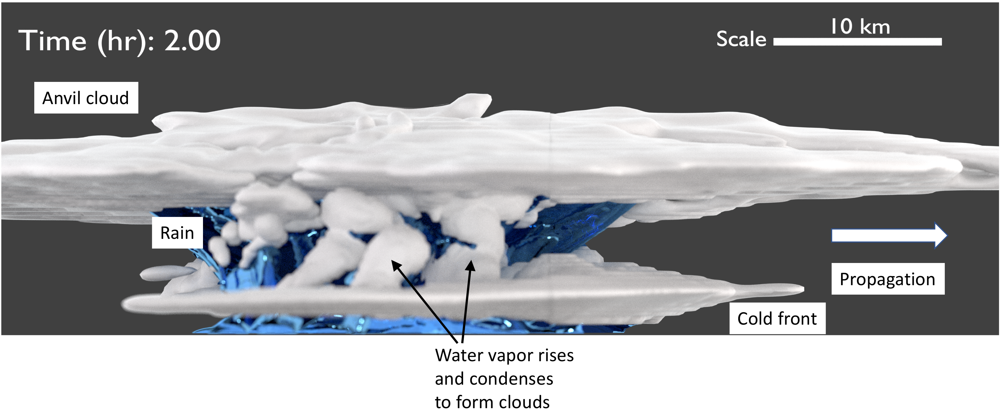
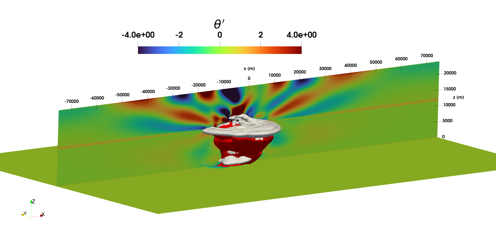
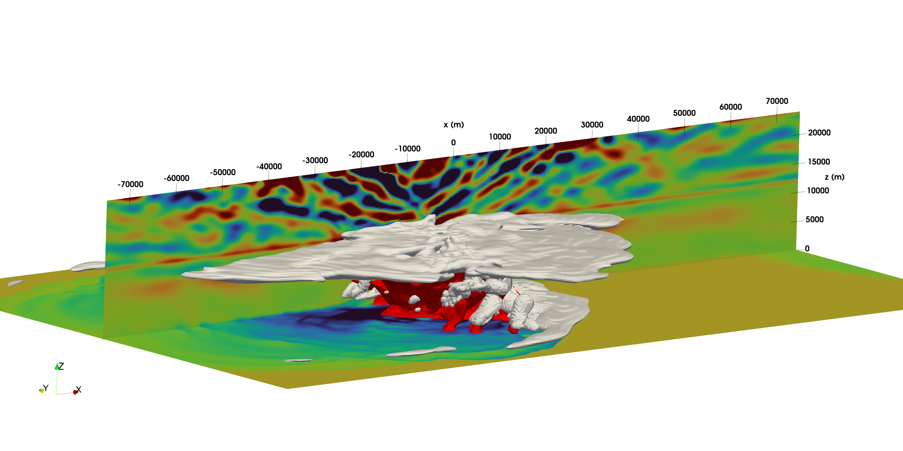
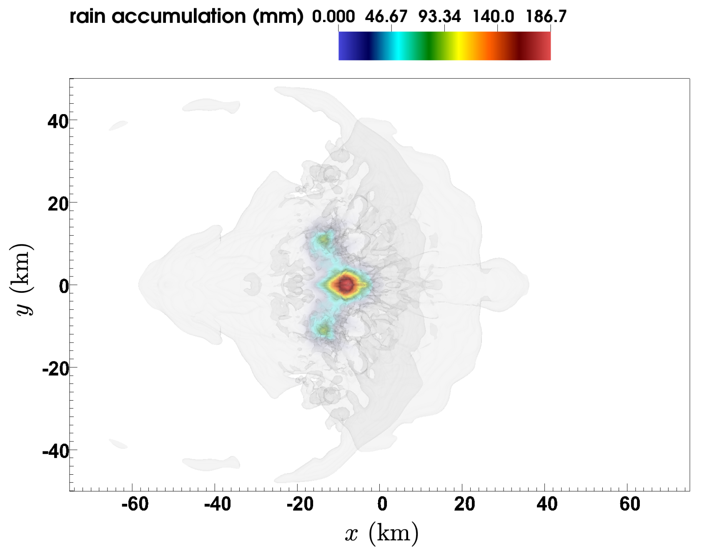

# Three-dimensional super cell

The supercell case is a three-dimensional version of the squall line described in Section~\ref{subsub:squall}, and has been recently studied by \citet{Tissaoui_2022,kang2024multiscale}. The problem involves domain lengths of $(L_x, L_y, L_z) = (150 \times 10^3, 100 \times 10^3, 24 \times 10^3)$ [m] and grid resolutions of $(\Delta x, \Delta y, \Delta z) = (250, 250, 250)$ [m]. The simulation is run for 2 hours, with an RK3 time step of 0.5 [s] and 2 acoustic sub-steps in the last RK stage. Periodic boundary conditions are applied in the stream-wise direction and open boundary conditions are implemented in the span-wise direction. A slip-wall boundary condition is used at the bottom while an outflow condition is applied at the top – i.e., linear extrapolation for scalar quantities and Neumann conditions for the vertical velocity. The 3rd order upwind scheme was used for advection and Kessler microphysics was utilized for moisture. Constant diffusivities of $\nu = \alpha_{i} = 33.33$ [$m^2$/s] were used for momentum and all scalars; no turbulence model was employed.

The initial background state and the wind shear are the same as the squall line test case but the initial warm bubble is three-dimensional and characterized by:

$$
r = \sqrt{\left( \frac{x - x_c}{x_r} \right)^2 + \left( \frac{y - y_c}{y_r} \right)^2 + \left( \frac{z - z_c}{z_r} \right)^2},
$$

with $x_c = 75 \times 10^3$ [m], $z_c = 2 \times 10^3$ [m], $x_r = 10 \times 10^3$ [m], and $z_r = 1.5 \times 10^3$ [m].

The evolution of the three-dimensional supercell is qualitatively similar to the two-dimensional squall line; see Section~\ref{subsub:squall}. The initial warm, moist bubble rises upward due to buoyancy, and as the bubble rises, water vapor begins to condense to form cloud water at approximately $t = 300$ [s]. The cloud water agglomerates to form rain at approximately $t = 540$ [s], and precipitation accumulation on the ground begins at $\approx t = ??$ [s]. The under-saturated cloud water and the falling rain evaporate leading to the formation of more water vapor that rises and condenses, creating a feedback loop that intensifies the supercell. 

Figure~\ref{fig:SC_ray_trace} shows a ray-trace rendering of the supercell at $t = 7200$ [s], highlighting the main features of the supercell evolution. The isocontour of cloud water mixing ratio ($q_c = 10^{-5}$ [kg/kg]) in white, rain water mixing ratio ($q_r = 10^{-4}$ [kg/kg]) in blue, the anvil cloud structure, rain-cooled cold front, and the storm propagation are shown.

Figure~\ref{fig:SC_qc_qr_pot_temp} shows the evolution of $q_c$, $q_r$, and $\theta_{d}^{\prime}$ ($y = 0$ and $z = 0$ slices) at $t = 1800$, $3600$, $5400$, and $7200$ [s]. It can be seen from the cloud water isocontour that the cold front evolves into a characteristic bow-shaped structure and propagates to the right. The maximum height to which the cloud rises is approximately 14 [km]. The $z = 0$ slice of the potential temperature perturbation shows the formation of a rain-cooled region near the ground as latent heat gets absorbed from the surrounding air due to rain evaporation. The $q_r$ isocontour shows that the rain formation is confined to the central region of the supercell, spanning approximately 20 [km] and 40 [km] in the $x$- and $y$-directions, respectively. The precipitation region on the ground is further confined to a smaller region, with the heaviest accumulation observed within a region of 10 [km] and 5 [km] in the $x$- and $y$-directions, respectively.

Ray trace rendering of the supercell evolution highlighting the main features. Isocontours of cloud water ($q_c = 10^-5$ [kg/kg]) in white and rain water ($q_r = 10^-4$ [kg/kg]) in blue are shown.

---

Isocontour of cloud water mixing ratio ($q_c = 10^{-5}$ [kg/kg]) in white, rain water mixing ratio ($q_r = 10^{-4}$ [kg/kg]) in red, and contours of potential temperature perturbation (y=0 and z=0 slices) ($\theta_d^{\prime} = \theta_d(t) - \theta_d(0)$ [K]) at $t = 1800$ s, and 7200 s, and the total rain accumulation on the ground in mm at $t = 7200$ s (top to bottom).

