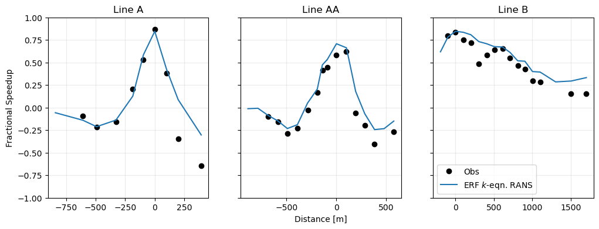

# DNS of Turbulent Flow through a Plane Channel

We consider the 9 m/s, 210° case from Wagenbrenner et al. 2019, _Atmosphere_.

Reference data were downloaded from [this repo](https://github.com/nwagenbrenner/windninja-tools).

For more information about the simulation setup, see `Examples/Real_Terrain/Askervein/README.md`
in the ERF source code repository.

## Results

Compare with Wagenbrenner et al. 2019, Fig. 8):

